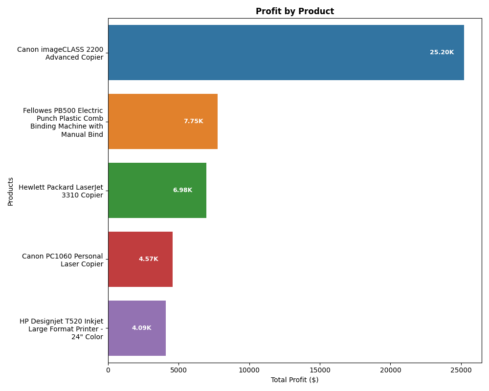
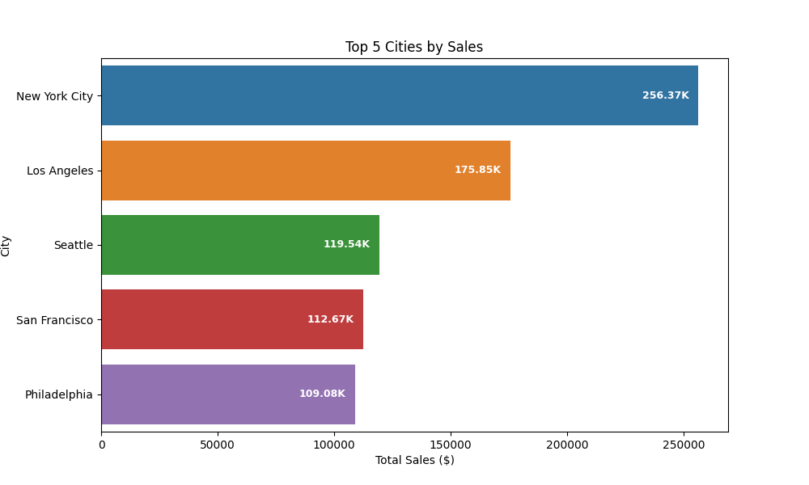
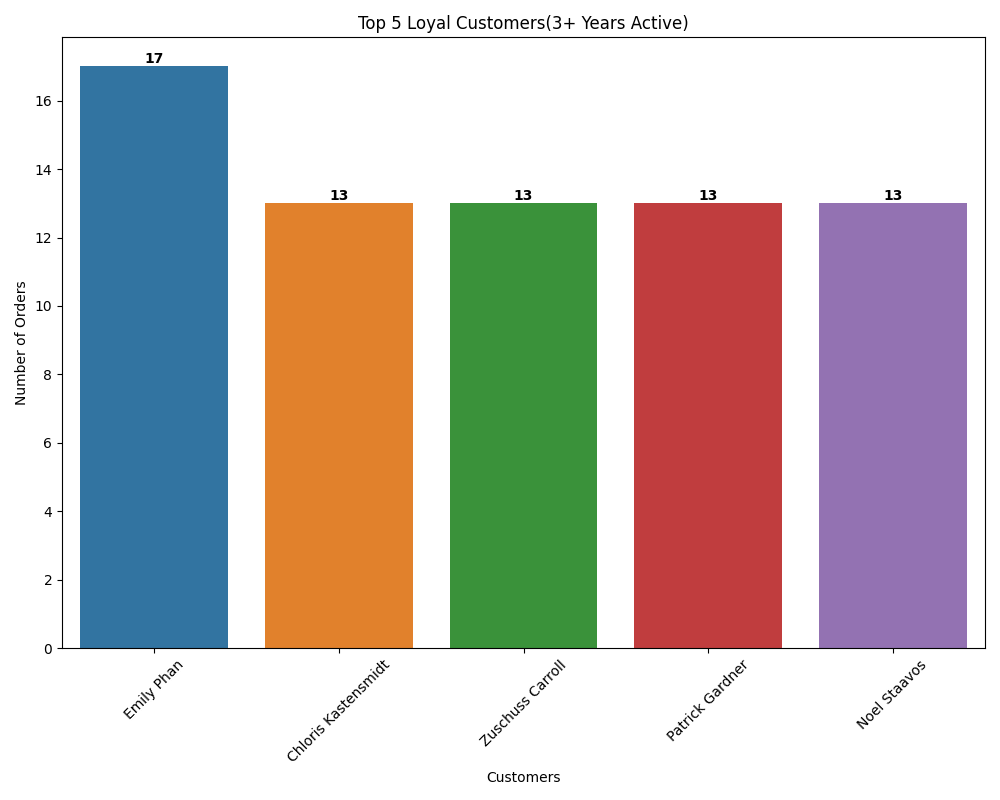
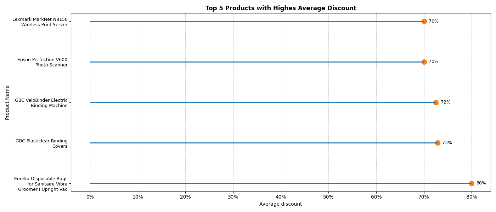

# Superstore Sales Analysis

## Overview
This project dives into the US Superstore dataset to uncover actionable insights on top products, cities, loyal customers, and discounts, fueling data-driven strategies for sales and marketing. As my first data analytics project, it's a stepping stone toward becoming a Data Scientist. Built with Python, Pandas, Seaborn and Matplotlib, this portfolio piece showcases my skills in data cleaning, visualization, and analysis, paving the way for future challenges.

I recognize that the tasks/functions of a Data Scientist differ from a Data Analyst, my goal is to build my skills in Python and coding in general as it's a very new field for me!

## Questions
- How much profit is gained for each product?
- People from which city/state shop the most (by sales)?
- Which customer is regular/loyal over the years?
- Which products have the highest discount rate?

## Dataset
- **Source**: [US Superstore dataset](https://www.kaggle.com/datasets/juhi1994/superstore/data) from Kaggle.
- **Format**: Excel ('.xls'), ~9994 rows, 21 columns (e.g., 'Sales', 'Category', 'Region', 'Customer Name', 'Order Date').
- **Cleaning**: Converted 'Order Date' to datetime, removed duplicates and missing values, saved as 'cleaned_superstore.csv'.

## Tools
- **Python**: Data analysis and visualization.
- **Libraries**: Pandas (data manipulation), Seaborn/Matplotlib (visuals), textwrap(label wrapping.)

## Findings
- **Profit by Product**: 

  | Product Name                     | Profit       |
  |:---------------------------------|-------------:|
  | Canon imageCLASS 2200…           |  $25,199.93  |
  | Fellowes PB500…                  |   $7,753.04  |
  | Hewlett Packard LaserJet…        |   $6,983.88  |
  | Canon PC1060…                    |   $4,570.93  |
  | HP Designjet T520…              |   $4,094.98  |
- **Top Cities by Sales**:
  | City                             | Sales         |
  |:---------------------------------|--------------:|
  | New York City                    |  $256,368.16  |
  | Los Angeles                      |  $175,851.34  |
  | Seattle                          |  $119,540.74  |
  | San Francisco                    |  $112,669.09  |
  | Philadelphia                     |  $109,077.01  |

- **Top Loyal Customers**:
  | Customer Name                    | Order Count   | Years Active |
  |:---------------------------------|---------------|-------------:|
  | Emily Phan                       |  $256,368.16  |      4       |
  | Chloris Kastensmidt              |  $175,851.34  |      4       |
  | Zuschuss Carroll                 |  $119,540.74  |      4       |
  | Patrick Gardner                  |  $112,669.09  |      4       |
  | Noel Staavos                     |  $109,077.01  |      4       |
 
- **Top Products with High Discount Rate**:
  | Product Name                                    |Discount Rate |
  |:------------------------------------------------|---------:|
  |Eureka Disposable Bags for Sanitaire Vibra Gro...|  80.00%  |
  |GBC Plasticlear Binding Covers                   |  72.86%  |
  |GBC VeloBinder Electric Binding Machine          |  72.50%  |
  |Epson Perfection V600 Photo Scanner              |  70.00%  |
  |Lexmark MarkNet N8150 Wireless Print Server      |  70.00%  |

## Visuals
- **Profit by Product**: Horizontal bar chart with internal profit values (`profit_by_product_bar.png`)  
  
- **City Sales**: Horizontal bar chart with internal sales values (`sales_by_city_horizontal.png`)  
  
- **Loyal Customers**: Vertical bar chart with internal order counts (`loyal_customers_bar.png`)  
  
- **High Discount Products**: Lollipop chart with percentage x-axis (`discount_by_product_lollipop.png`)  
  

## License
[MIT License](LICENSE) (free to use, modify, share).